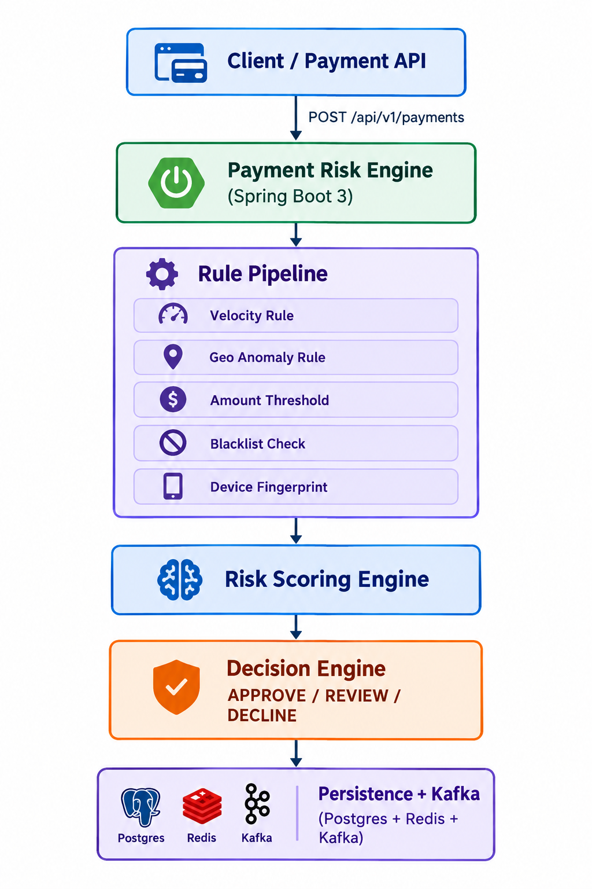

# Payment Risk Engine

Real-time fraud detection & risk scoring system for payment transactions.
Built with Spring Boot 3, PostgreSQL, Redis, Kafka.

## 🎯 Problem

Banks and payment processors handle millions of transactions per day, and even a
0.1% fraud rate translates to massive financial losses and regulatory penalties.
Traditional rule-based systems are too slow and too rigid to catch modern fraud
patterns. This project simulates a **real-time payment risk engine** that evaluates
every transaction in milliseconds and decides whether to approve, flag for review,
or decline it — the same core problem JP Morgan, Visa, and Stripe solve at scale.

## 🏗️ Architecture



> **Note:** Architecture diagram coming soon. Placeholder image pending.

## ⚙️ Tech Stack

- **Language:** Java 17
- **Framework:** Spring Boot 3.x
- **Database:** PostgreSQL (transaction & audit persistence)
- **Cache:** Redis (real-time velocity counters)
- **Messaging:** Apache Kafka (async event publishing)
- **Build Tool:** Maven
- **Containerization:** Docker + docker-compose
- **CI/CD:** GitHub Actions
- **Testing:** JUnit 5, Mockito, Testcontainers
- **Monitoring:** Spring Actuator, Micrometer, Prometheus

## 🚀 Features

- [ ] Payment intake API (REST endpoint with validation)
- [ ] Project scaffolding & docs
- [ ] Rule engine (velocity, geo, amount, blacklist)
- [ ] Risk scoring + decision engine
- [ ] Audit log & persistence layer
- [ ] Redis-based velocity counters
- [ ] Kafka event publishing
- [ ] Admin dashboard (flagged transactions, overrides)
- [ ] Docker & docker-compose setup
- [ ] CI pipeline with GitHub Actions
- [ ] Swagger / OpenAPI docs
- [ ] Load testing & benchmarks

## 📚 API Docs

Swagger UI will be available at:
`http://localhost:8080/swagger-ui.html`

*(Link will be live once the API module is complete.)*

## 🧪 How to Run

### Prerequisites
- Java 17+
- Docker & Docker Compose
- Maven (or use the included `./mvnw` wrapper)

### Steps

```bash
# 1. Clone the repository
git clone https://github.com/[your-username]/payment-risk-engine.git
cd payment-risk-engine

# 2. Copy environment file
cp .env.example .env

# 3. Start dependencies (PostgreSQL, Redis, Kafka)
docker-compose up -d

# 4. Run the Spring Boot application
./mvnw spring-boot:run

```
## 🤝 Contributing

This is a personal learning project, but suggestions and feedback are welcome.
Please open an issue first to discuss any major changes.

## 📄 License

This project is licensed under the MIT License — see the [LICENSE](./LICENSE) file.

## 👤 Author

**KARAN RASTOGI**
- LinkedIn:
- Email: krnrastogi18@gmail.com
- GitHub: [@Karan-Rastogi](https://github.com/Karan-Rastogi)

---

⭐ If you find this project useful or interesting, feel free to star the repo!
